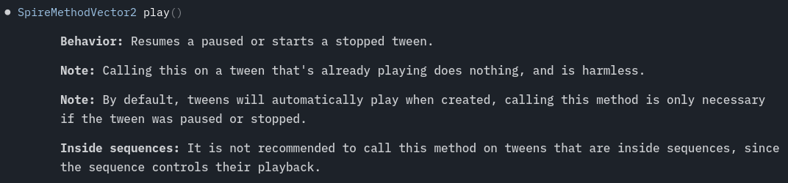
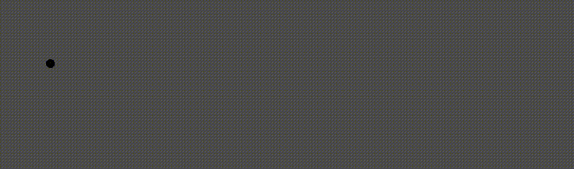
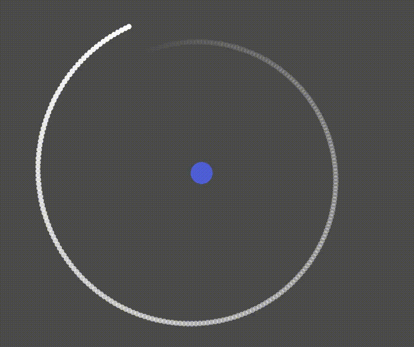
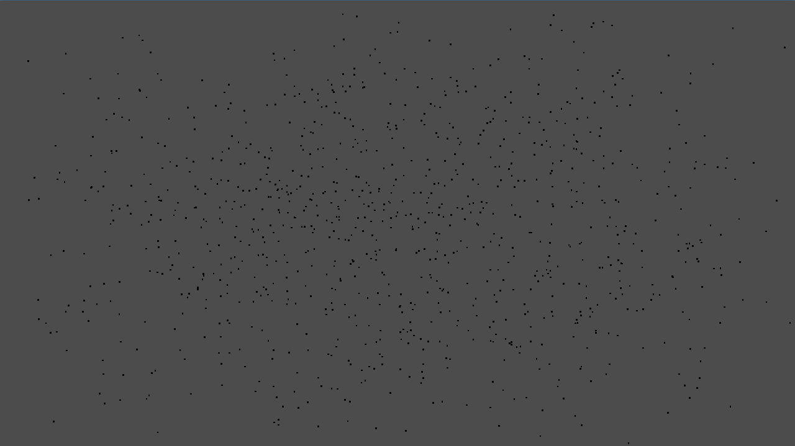
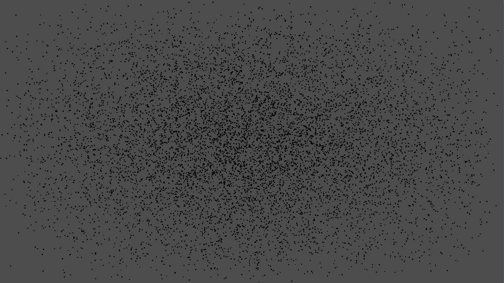
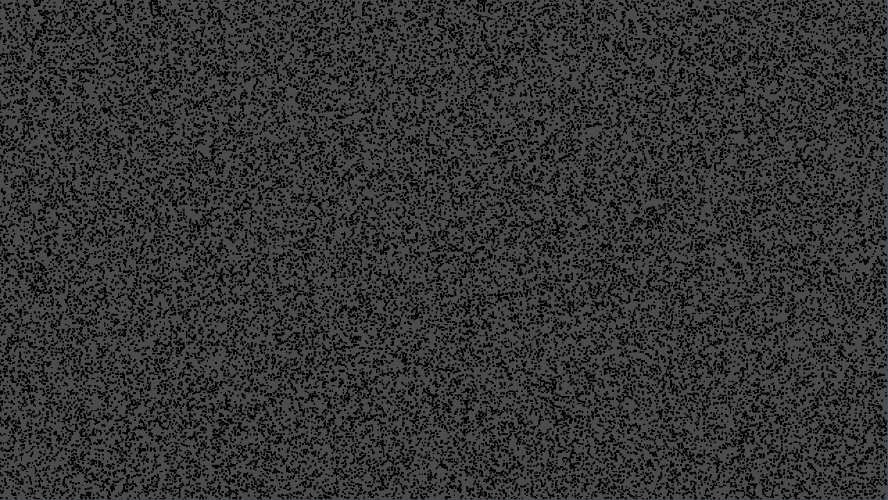
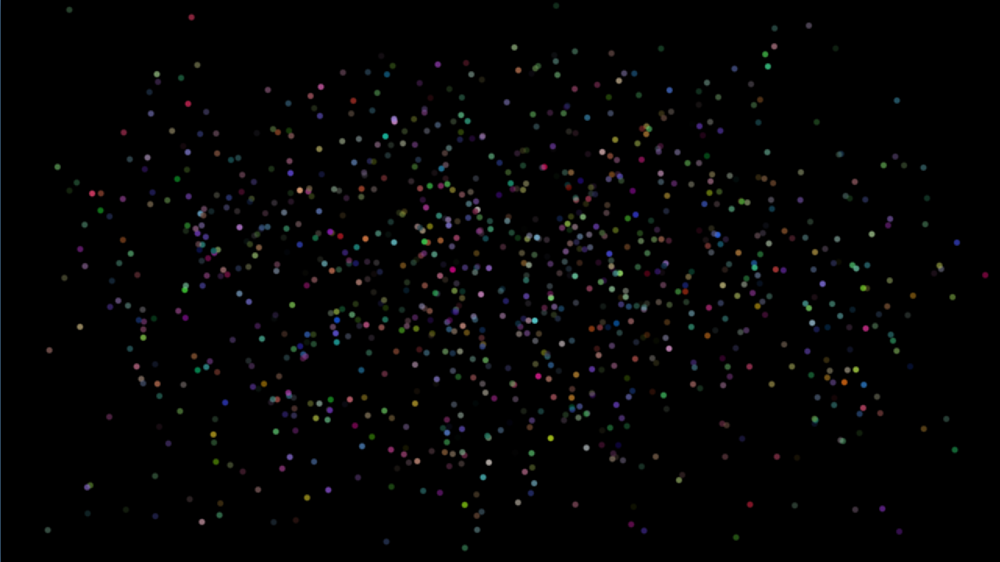
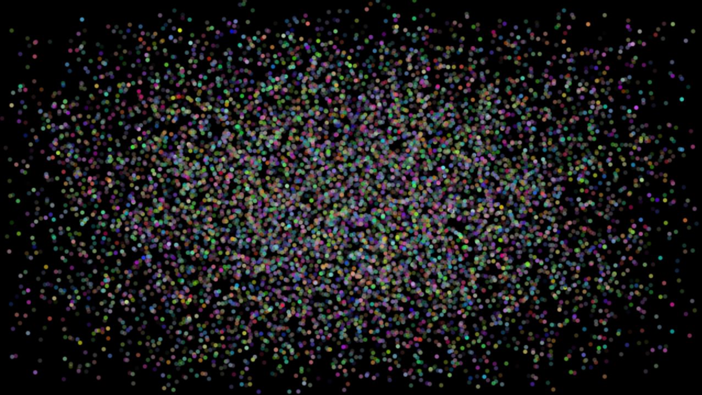
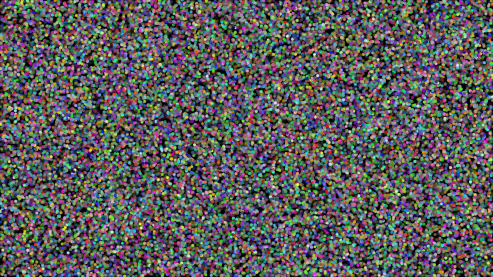

# SpireTween

An addon that provides a fast and ergonomic tweening library for Godot 4.x, inspired on the design of the
popular Unity library [DoTween](https://dotween.demigiant.com/).

These are the priorities of SpireTween:

- Ergonomics without compromising performance (see the section [Benchmarks](#benchmarks)).
- Type safety, taking advantage of GDScript's type system to catch errors at compile time rather than runtime.
- "No surprises": Spire's public API is thoroughly (and proudly!) documented,
  with method descriptions mentioning possible side effects and quirks. I also wrote plenty of integration tests to make sure the behavior
  matches what's written in the docs (see folder [tests](spire_tween_gdscript/examples/tests)).
  Here's an example: The method `play` that all tweens have (screenshot taken from inside Godot's editor):
  
- At minimum, feature parity with Godot's built-in tweening system (after all, why would you want a downgrade?).
  SpireTween also provides more features, such as: speed-based tweens, more loop modes, etc.

# Table of Contents

- [Installation](#installation)
- [Configuration](#configuration)
- [Cheat Sheets](#cheat-sheets-built-in-tween---spiretween)
- [Examples](#examples)
- [Benchmarks](#benchmarks)

# Installation

SpireTween is an addon like any other, just copy the addon folder into "res://addons/".

(That's it)

# Configuration

Currently, SpireTween supports a single global configuration option, which lets you define what is the default "Ease" type when creating tweens.
You can set this option by calling `SpireGlobalSettings.set_default_ease`:

```gdscript
func _ready():
    # Set the default easing to "In-Out Sine", which is Godot's built-in Tween's default easing.
    SpireGlobalSettings.set_default_ease(Spire.EASE_IN_OUT_SINE)
```

If not set, the default is `Spire.EASE_LINEAR`.

# Cheat Sheets: Built-in Tween -> SpireTween

## Cheat Sheet: Type analogies

*(From here on, the names in the table bellow may be used interchangeably.)*

| Godot Built-in  | SpireTween                                          |
|-----------------|-----------------------------------------------------|
| Tween           | SpireSequence                                       |
| PropertyTweener | SpireProperty{Type}                                 |
| MethodTweener   | SpireMethod{Type}                                   |
| CallbackTweener | SpireDelayedCall                                    |
| IntervalTweener | No type, use `SpireSequence.append_interval(float)` |
| SubtweenTweener | SpireSequence[note1](#note-subtweeners)             | 

<a name="note-subtweeners"></a>
Note 1: A `SpireSequence` is itself a `SpireTween`, so you can append sequences into others,
recursively.

---

**Note:** In the tables below, the columns "Godot Class(es)" and "Spire Class(es)" indicate which classes support the feature.

## Cheat Sheet: Properties

Cheat sheet for reading/writing properties/configuration that are common to both systems:

| Property                                                                |                    Godot Class(es)                    |        Godot Read        |                     Godot Write                      |          Spire Class(es)           |        Spire Read        |                          Spire Write                          |
|-------------------------------------------------------------------------|:-----------------------------------------------------:|:------------------------:|:----------------------------------------------------:|:----------------------------------:|:------------------------:|:-------------------------------------------------------------:|
| Loops (total) ([note1](#note-loop-modes))                               |                         Tween                         |            ❌             |                    set_loops(int)                    |                All                 |       get_loops()        |                set_loops(int, Spire.LoopMode)                 |
| Loops Left                                                              |                         Tween                         |     get_loops_left()     |                          ❌                           |                All                 |     get_loops_left()     |                               ❌                               |
| Loops Completed                                                         |                           ❌                           |            ❌             |                          ❌                           |                All                 |   get_loops_finished()   |                               ❌                               |
| Loop Mode                                                               |                           ❌                           |            ❌             |                          ❌                           |                All                 |     get_loop_mode()      |                 set_loop_mode(Spire.LoopMode)                 |
| Run                                                                     |                         Tween                         |       is_running()       |                        play()                        |                All                 |       is_playing()       |                            play()                             |
| Pause                                                                   |                         Tween                         |      !is_running()       |                       pause()                        |                All                 |       is_paused()        |                            pause()                            |
| Stop                                                                    |                         Tween                         |            ❌             |                        stop()                        |                All                 |       is_stopped()       |                            stop()                             |
| Validity ([note2](#note-is-valid))<br/>(is it "ticked" on each update?) |                         Tween                         |        is_valid()        |                        kill()                        |                All                 |     is_registered()      |                  register()<br/>unregister()                  |
| Delay                                                                   |           PropertyTweener<br/>MethodTweener           |            ❌             |                   set_delay(float)                   |                All                 |       get_delay()        |                       set_delay(float)                        |
| Elapsed Time (total)                                                    |                         Tween                         | get_total_elapsed_time() |                          ❌                           |                All                 | get_total_elapsed_time() |                               ❌                               |
| Animation position (current loop's elapsed time, after any delays)      |                         Tween                         |            ❌             |                          ❌                           |                All                 | get_animation_position() |                               ❌                               |
| Ignore Time Scale ([note3](#note-ignore-time-scale))                    |                         Tween                         |            ❌             |             set_ignore_time_scale(bool)              |                All                 | get_ignore_time_scale()  |                  set_ignore_time_scale(bool)                  |
| Speed Scale                                                             |                         Tween                         |            ❌             |                set_speed_scale(float)                |                All                 |    get_speed_scale()     |                    set_speed_scale(float)                     |
| Pause Mode                                                              |                         Tween                         |            ❌             |            set_pause_mode(TweenPauseMode)            |                All                 |     get_pause_mode()     |                set_pause_mode(Spire.PauseMode)                |                                                               
| Process Mode                                                            |                         Tween                         |            ❌             |          set_process_mode(TweenProcessMode)          |                All                 |    get_process_mode()    |              set_process_mode(Spire.ProcessMode)              |                                                               
| Lifetime Bound ([note4](#note-bind-node)                                |                         Tween                         |            ❌             |                   bind_node(Node)                    |                All                 |    get_bound_nodes()     | bind_node(Node)<br/>unbind_node(Node)<br/>clear_bound_nodes() |
| Easing (enum)                                                           |                    PropertyTweener                    |            ❌             |    set_ease(EaseType) + set_trans(TransitionType)    |   SpireProperty<br/>SpireMethod    |        get_ease()        |                     set_ease(Spire.Ease)                      |
| Easing (func)                                                           |                    PropertyTweener                    |            ❌             |          set_custom_interpolator(Callable)           |   SpireProperty<br/>SpireMethod    |        get_ease()        |                    set_ease_func(Callable)                    |
| Easing (curve)                                                          |                    PropertyTweener                    |            ❌             | set_custom_interpolator(curve_variable.sample_baked) |   SpireProperty<br/>SpireMethod    |        get_ease()        |                     set_ease_curve(Curve)                     |
| Relative Mode                                                           |                    PropertyTweener                    |            ❌             |                    as_relative()                     |           SpireProperty            |      is_relative()       |                         as_relative()                         |
| Speed-Based Mode                                                        |                           ❌                           |            ❌             |                          ❌                           |           SpireProperty            |     is_speed_based()     |                       as_speed_based()                        |
| Start Value (property)                                                  |                    PropertyTweener                    |            ❌             |                    from(Variant)                     |           SpireProperty            |            ❌             |                         from({Type})                          |
| Start Value (property) (as current)                                     |                    PropertyTweener                    |            ❌             |                    from_current()                    |           SpireProperty            |            ❌             |         Not necessary, this is the default behavior.          |
| Start Value (method)                                                    |                     MethodTweener                     |            ❌             |             Set when creating the tween.             |            SpireMethod             |    get_start_value()     |                 Set when creating the tween.                  |
| Final Value                                                             |           PropertyTweener<br/>MethodTweener           |            ❌             |             Set when creating the tween.             |   SpireProperty<br/>SpireMethod    |    get_final_value()     |                 Set when creating the tween.                  |
| Tweened Property's path                                                 |                    PropertyTweener                    |            ❌             |             Set when creating the tween.             |           SpireProperty            |   get_property_path()    |                 Set when creating the tween.                  |
| Object that owns the property/method being tweened                      |                    PropertyTweener                    |            ❌             |             Set when creating the tween.             |           SpireProperty            |       get_owner()        |                 Set when creating the tween.                  |
| Duration                                                                | PropertyTweener<br/>MethodTweener<br/>IntervalTweener |            ❌             |             Set when creating the tween.             | SpireProperty<br/>SpireMethod<br/> |      get_duration()      |                 Set when creating the tween.                  |
| Callable being tweened                                                  |                     MethodTweener                     |            ❌             |             Set when creating the tween.             |  SpireMethod<br/>SpireDelayedCall  |      get_callable()      |                 Set when creating the tween.                  |

Although both systems share many properties, Godot's built-in `Tween` does not expose getters for most of them, while SpireTween exposes getters to almost all.
This isn't a big deal, the maintainers of Godot probably decided to not expose those getters since most use cases wouldn't need to read those properties after creating the tween.
That's a reasonable design decision, though I have a different philosophy: I can't predict all possible use cases, so I prefer to expose more information rather than less, specially when
doing so is trivial/harmless.

<a name="note-loop-modes"></a>

**Note 1**: Spire supports 3 different loop modes: Restart (the default), Yoyo, and Incremental. See the enum's documentation for more details.

<a name="note-is-valid"></a>

**Note 2**: In Godot's builtin `Tween`, `kill()` is a permanent operation.
In Spire, `unregister()` simply removes a tween from the internal update list, it can be re-registered again later with `register()`.
Since Spire's tweens are reference-counted, there's no need to manually free them (which is what `kill()` is supposed to do).

<a name="note-ignore-time-scale"></a>

**Note 3**: In Godot's builtin `Tween`, this is only available for the `Tween` class (equivalent to Spire's `SpireSequence`), and it affects all
child "tweeners". In Spire, the behavior is the same for `SpireSequence`, but it is also available to individual tweeners.

<a name="note-bind-node"></a>
**Note 4**: Godot only supports binding to a single node, while Spire supports binding to multiple nodes. Also, the semantics of binding are slightly different on each
system, see their documentation for more details.

---

## Cheat Sheet: Methods

| Feature                            | Godot Class(es) |                                                  Godot "how to"                                                   | Spire Class(es) |                                          Spire "how to"                                          |
|------------------------------------|:---------------:|:-----------------------------------------------------------------------------------------------------------------:|:---------------:|:------------------------------------------------------------------------------------------------:|
| Manual Stepping                    |      Tween      |                                                custom_step(float)                                                 |       All       |                                        custom_step(float)                                        |
| Instant completion                 |      Tween      |                                           custom_step(very_big_number)                                            |       All       |                                         force_complete()                                         |
| Kill                               |      Tween      |                                                      kill()                                                       |       All       |                                           unregister()                                           |
| Resuscitate ("Unkill")             |        ❌        |                                                         ❌                                                         |       All       |                                            register()                                            |
| Sequencing - Series                |      Tween      | Tweener builder methods (`Tween.tween_*()`) do this automatically.<br/>More complex cases require using `chain()` |  SpireSequence  | append(AnyTweenType)<br/>append_call(Callable)<br/>append_interval(float)<br/>append_many(Array) |
| Sequencing - Parallel              |      Tween      |            Call `set_parallel(true)`, then use one of the builder methods (`Tween.tween_*()`) as usual            |  SpireSequence  |       join(AnyTweenType)<br/>join_call(Callable)<br/>join( interval)<br/>join_many(Array)        |
| Sequencing - Insertion             |        ❌        |                                                         ❌                                                         |  SpireSequence  |                   insert(float, AnyTweenType)<br/>insert_call(float, Callable)                   |
| Sequencing - Remove child tween    |        ❌        |                                                         ❌                                                         |  SpireSequence  |                          remove(AnyTweenType)<br/>remove_call(Callable)                          |
| Sequencing - Default children ease |      Tween      |                                  set_ease(EaseType) + set_trans(TransitionType)                                   |  SpireSequence  |                              set_default_children_ease(Spire.Ease)                               |

## Cheat Sheet: Signals

| Emission Condition                    | Godot Class(es) |          Godot Signal          | Spire Class(es) |               Spire Signal               |
|---------------------------------------|:---------------:|:------------------------------:|:---------------:|:----------------------------------------:|
| Completed (Entire tween)              |      Tween      |           finished()           |       All       |                finished()                |
| Completed (Single loop)               |      Tween      | loop_finished(loop_count: int) |       All       | loop_finished()[note1](#note-loop-count) |
| Sequencing - Parallel Group completed |      Tween      |       step_finished(int)       | ~SpireSequence  |  Use the children's "finished" signals.  |

<a name="note-loop-count"></a>
**Note 1**: `loop_count` isn't provided with the signal but can be retrieved with `get_loops_finished()`.

---

## Cheat Sheet: Creating a Tween(er)

| Tween type                                     | Godot "how to"                                                                                  | Spire "how to"                                                                                                                                                                             |
|------------------------------------------------|-------------------------------------------------------------------------------------------------|--------------------------------------------------------------------------------------------------------------------------------------------------------------------------------------------|
| Property by "inlined" name                     | ❌                                                                                               | Do{Class}.{property_name}(object: {Class}, to: {Type}, duration: float)                                                                                                                    |
| Property by path (typed)                       | ❌                                                                                               | Spire.do_property_{type}(object: Object, property: NodePath, to: {Type}, duration: float)                                                                                                  |
| Property by path (untyped)                     | create_tween().tween_property(object: Object, property: NodePath, to: Variant, duration: float) | Spire.do_property(object: Object, property: NodePath, to: Variant, duration: float)                                                                                                        |
| Property by path (custom/non-primitive type)   | create_tween().tween_property(object: Object, property: NodePath, to: Variant, duration: float) | Spire.do_property_custom(object: Object, property: NodePath, to: Variant, duration: float, distance_func: Callable, lerp_func: Callable, add_relative_func: Callable, step_func: Callable) |
| Method by callable (typed)                     | ❌                                                                                               | Spire.do_call_{type}(callable: Callable, from: {Type}, to: {Type}, duration: float)                                                                                                        |
| Method by callable (untyped)                   | create_tween().tween_method(method: Callable, from: Variant, to: Variant, duration: float)      | Spire.do_call(callable: Callable, from: Variant, to: Variant, duration: float)                                                                                                             |
| Method by callable (custom/non-primitive type) | create_tween().tween_method(method: Callable, from: Variant, to: Variant, duration: float)      | Spire.do_call_custom(callable: Callable, from: Variant, to: Variant, duration: float, lerp_func: Callable)                                                                                 |
| Delayed Callback                               | create_tween().tween_callback(callback: Callable).set_delay(delay: float)                       | Spire.do_delayed_call(callable: Callable, delay: float)                                                                                                                                    |

# Examples

*For "live" example scenes that you can play, see folder [examples](spire_tween_gdscript/examples).*

## Tweening Properties

### Common properties of built-in classes

Godot's built-in system provides a single method to create all property tweeners: [Tween.tween_property]
(https://docs.godotengine.org/en/stable/classes/class_tween.html#class-tween-method-tween-property). Because of that,
it cannot provide type safety and the checks must be performed at runtime.

Spire takes two approaches, the first is that it provides many static functions that will tween a specific property of a
specific class, these are presented in the format:

```
Do{NodeClass}.{property_name}(node: {NodeClass}, to: {Type}, duration: float) -> SpireProperty{Type}
   ^^^^^^^^^                                          ^^^^
# Node2D, CanvasItem, etc.                      float, Vector2, etc.
```

Examples: `DoNode2D.global_position`, `DoCanvasItem.modulate_a`, `DoControl.rotation`.

Since we know the class and property at compile time, the GDScript compiler will yell if you accidentally try to pass bad arguments.

The second approach, which is meant for cases where you want to tween a custom property, is to provide an API similar to
Godot's built-in, except that the API is split into multiple methods based on the type being tweened.

These static functions are available in the `Spire` class:

```
do_property(owner: Object, property_path: NodePath, to: Variant, duration: float) -> SpireProperty
do_property_int(owner: Object, property_path: NodePath, to: int, duration: float) -> SpirePropertyInt
do_property_float(owner: Object, property_path: NodePath, to: float, duration: float) -> SpirePropertyFloat
do_property_vector2(owner: Object, property_path: NodePath, to: Vector2, duration: float) -> SpirePropertyVector2
do_property_color(owner: Object, property_path: NodePath, to: Color, duration: float) -> SpirePropertyColor
# ... and so on for Vector2i, Vector3, Vector3i, String and Variant.
```

Example: Tweening the property `global_position` of a Node2D, as well as the `r` component of the `modulate` property of a `CanvasItem`.

File: [example_common_property.tscn](spire_tween_gdscript/examples/readme/example_common_property.tscn)



```gdscript
func godot_impl():
	self.create_tween().tween_property(circle, ^"global_position", destination, duration)
	self.create_tween().tween_property(circle, ^"modulate:r", 1.0, duration)

func spire_impl():
	# Signature: func(node: Node2D, to: Vector2, duration: float) -> SpirePropertyVector2 
	DoNode2D.global_position(circle, destination, duration)
	# Signature: func(node: CanvasItem, to: float, duration: float) -> SpirePropertyFloat
	DoCanvasItem.modulate_r(circle, 1.0, duration)
```

### Custom/uncommon properties

Example: Tweening the distance of a ball from the center of the screen, using a custom property with getter/setter.

File: [example_custom_property.tscn](spire_tween_gdscript/examples/readme/example_custom_property.tscn)



```gdscript
extends Sprite2D

@onready var repelled_particle: Sprite2D = $"RepelledParticle"

var distance_to_repeller: float:
	get: return self.global_position.distance_to(repelled_particle.global_position)
	set(new_distance): 
		var old_distance := distance_to_repeller
		var distance_diff := new_distance - old_distance
		var direction := self.global_position.direction_to(repelled_particle.global_position)
		repelled_particle.global_position += direction * distance_diff

func _ready():
	# Signature: func(obj: Object, property_path: NodePath, to: float, duration: float) -> SpirePropertyFloat
	Spire.do_property_float(self, ^"distance_to_repeller", 400, 3.0)\
		.set_ease(Spire.EASE_IN_OUT_SINE)\
		.set_loops(-1, Spire.LOOP_MODE_YOYO)
	
	DoNode2D.rotation(self, PI * 2, 4.0).from(0).set_loops(-1)
	
	get_tree().physics_frame.connect(spawn_trail)

func spawn_trail():
	var trail: Sprite2D = repelled_particle.duplicate()
	add_child(trail)
	trail.top_level = true
	trail.global_position = repelled_particle.global_position
	
	DoCanvasItem.color_a(trail, 0.0, 4.0)\
		.finished.connect(trail.queue_free)
```

## Tweening Methods

Example: Drawing a rope by instantiating dots along a line.

File: [example_method.tscn](spire_tween_gdscript/examples/readme/example_method.tscn)


```gdscript 
# Note: Physics mode is used to make the dots spawn in fixed intervals
func godot_impl():
	self.create_tween()\
		.set_process_mode(Tween.TWEEN_PROCESS_PHYSICS)\
		.tween_method(create_dot, from, to, duration)

func spire_impl():
	# Signature: func(callable: Callable, from: Vector2i, to: Vector2i, duration: float) -> SpireMethodVector2i
	Spire.do_call_vector2i(create_dot, from, to, duration)\
		.set_process_mode(Spire.PROCESS_MODE_PHYSICS)

func create_dot(at: Vector2i) -> void:
	var dot: Sprite2D = DOT_PREFAB.instantiate()
	add_child(dot)
	dot.global_position = at
```

## Tweening in Series/Parallel

*For more details on how sequences work, see the class documentation of `SpireSequence`.*

Example: Moving a sprite along the sides of a rectangle, as well as making it flash red every time it reaches a corner.

File: [example_sequence](spire_tween_gdscript/examples/readme/example_sequence.tscn)


```gdscript
extends Sprite2D

func godot_impl():
	var tween := create_tween().set_loops(-1)
	var start_pos := vertices[3]
	
	for vert: Vector2 in vertices:
		var duration := vert.distance_to(start_pos) / speed
		tween.chain().tween_property(self, ^"global_position", vert, duration)
		start_pos = vert
		
		tween.parallel()\
			.tween_property(self, ^"modulate", Color.RED, flash_duration)\
			.finished.connect(
				func(): create_tween().tween_property(self, ^"modulate", Color.WHITE, flash_duration)
			)

func spire_impl():
	var seq := Spire.sequence().set_loops(-1)
	
	for vert: Vector2 in vertices:
		# `append` creates a new "step" in the sequence, which means that the tween "appended" will run after all previous steps finish.
		seq.append(DoNode2D.move(self, vert, speed).as_speed_based())
		
		# `join` adds another tween to the current step of the sequence.
		# In this case, it makes the tween bellow run(flash) at the same time as the tween above(movement).
		seq.join(
			DoCanvasItem.modulate(self, Color.RED, flash_duration)
				.set_loops(2, Spire.LOOP_MODE_YOYO) # yoyo loop will make it go red then back to the original color.
		)
```

# Benchmarks

Note that the main priority of SpireTween is ergonomics, not performance. It currently outperforms Godot's built-in
tweening system in terms of runtime speed (Godot's built-in wins in terms of setup speed though), I cannot guarantee that
this will always be the case, SpireTween may become slower if more features/configurations are added (though I doubt the
performance difference will ever be significant).

I decided to make these benchmarks to at least give you peace of my mind that you're not(currently) losing on performance
by switching to SpireTween. Note that the amount of nodes being tweened in these benchmarks is ridiculously high, you're unlikely
to ever notice any performance difference between the two libraries in a real project.

The benchmarks are in the folder [benchmarks](spire_tween_gdscript/benchmarks), to run them on your machine, just open one
of the scenes and run it.

The following results were obtained on my machine, here's the system info provided by Godot:

- Godot v4.5.1.stable
- Linux Mint 22.1 (Xia) on X11
- X11 display driver, Multi-window, 1 monitor
- Vulkan (Forward+)
- dedicated NVIDIA GeForce GTX 1080 Ti (nvidia; 570.195.03)
- AMD Ryzen 9 9900X 12-Core Processor (24 threads)
- 30.95 GiB memory

## Bench: Tweening "Node2D.global_position" - Black 4x4 Dots

### 1k Nodes



Setup time (lower is better)

| tween | setup(ms) |
|-------|-----------|
| Godot | 009.7300  |
| Spire | 005.5060  |

Frames per second (higher is better)

| tween | min     | max     | median  | mean    | std-dev |
|-------|---------|---------|---------|---------|---------|
| Godot | 4912.00 | 5046.00 | 5027.00 | 5012.46 | 37.4388 |
| Spire | 6064.00 | 6316.00 | 6219.00 | 6206.08 | 76.1396 |

Milliseconds per frame (lower is better)

| tween | min  | max  | median | mean | std-dev |
|-------|------|------|--------|------|---------|
| Godot | 0.18 | 1.39 | 0.20   | 0.20 | 00.0161 |
| Spire | 0.14 | 1.39 | 0.16   | 0.16 | 00.0167 |

### 10k Nodes



Setup time (lower is better)

| tween | setup(ms) |
|-------|-----------|
| Godot | 045.3460  |
| Spire | 069.4680  |

Frames per second (higher is better)

| tween | min    | max    | median | mean   | std-dev |
|-------|--------|--------|--------|--------|---------|
| Godot | 564.00 | 575.00 | 570.00 | 569.04 | 02.9928 |
| Spire | 939.00 | 972.00 | 965.00 | 962.70 | 09.5829 |

Milliseconds per frame (lower is better)

| tween | min  | max  | median | mean | std-dev |
|-------|------|------|--------|------|---------|
| Godot | 1.67 | 7.54 | 1.74   | 1.76 | 00.0960 |
| Spire | 0.13 | 4.17 | 1.03   | 1.04 | 00.0909 |

### 50k Nodes



Setup time (lower is better)

| tween | setup(ms) |
|-------|-----------|
| Godot | 410.7380  |
| Spire | 532.1270  |

Frames per second (higher is better)

| tween | min   | max   | median | mean  | std-dev |
|-------|-------|-------|--------|-------|---------|
| Godot | 62.00 | 63.00 | 63.00  | 62.75 | 00.4330 |
| Spire | 84.00 | 86.00 | 85.00  | 84.65 | 00.6920 |

Millisecond per frame (lower is better)

| tween | min   | max   | median | mean  | std-dev |
|-------|-------|-------|--------|-------|---------|
| Godot | 15.28 | 16.67 | 15.96  | 15.96 | 00.3692 |
| Spire | 11.29 | 16.67 | 11.89  | 11.82 | 00.2444 |

## Bench: Tweening "Node2D.global_position" & "CanvasItem.modulate" - 16x16 Circles - 1 Tween per property

### 1k Nodes

Setup Time (lower is better)

| tween | setup(ms) |
|-------|-----------|
| Godot | 004.6090  |
| Spire | 007.5260  |

Frames per second (higher is better)

| tween | min     | max     | median  | mean    | std-dev |
|-------|---------|---------|---------|---------|---------|
| Godot | 3417.00 | 3633.00 | 3612.00 | 3590.84 | 66.4161 |
| Spire | 5078.00 | 5239.00 | 5207.00 | 5169.92 | 61.8067 |

Milliseconds per frame (lower is better)

| tween | min  | max  | median | mean | std-dev |
|-------|------|------|--------|------|---------|
| Godot | 0.26 | 1.39 | 0.28   | 0.28 | 00.0290 |
| Spire | 0.17 | 1.39 | 0.19   | 0.19 | 00.0201 |

### 10k Nodes

Setup time (lower is better)

| tween | setup(ms) |
|-------|-----------|
| Godot | 054.8460  |
| Spire | 082.2870  |

Frames per second (higher is better)

| tween | min    | max    | median | mean   | std-dev |
|-------|--------|--------|--------|--------|---------|
| Godot | 313.00 | 317.00 | 316.00 | 315.59 | 01.3201 |
| Spire | 634.00 | 646.00 | 644.00 | 641.66 | 03.8848 |

Milliseconds per frame (lower is better)

| tween | min  | max   | median | mean | std-dev |
|-------|------|-------|--------|------|---------|
| Godot | 2.78 | 12.13 | 3.12   | 3.17 | 00.2072 |
| Spire | 0.20 | 1.74  | 1.55   | 1.56 | 00.0568 |

### 50k Nodes

Setup time (lower is better)

| tween | setup(ms) |
|-------|-----------|
| Godot | 462.8850  |
| Spire | 598.6750  |

Frames per second (higher is better)

| tween | min   | max   | median | mean  | std-dev |
|-------|-------|-------|--------|-------|---------|
| Godot | 38.00 | 40.00 | 39.00  | 39.08 | 00.5719 |
| Spire | 60.00 | 61.00 | 60.00  | 60.37 | 00.4825 |

Milliseconds per frame (lower is better)

| tween | min   | max   | median | mean  | std-dev |
|-------|-------|-------|--------|-------|---------|
| Godot | 23.91 | 33.28 | 25.26  | 25.57 | 00.9573 |
| Spire | 15.28 | 20.83 | 16.65  | 16.57 | 00.3078 |





